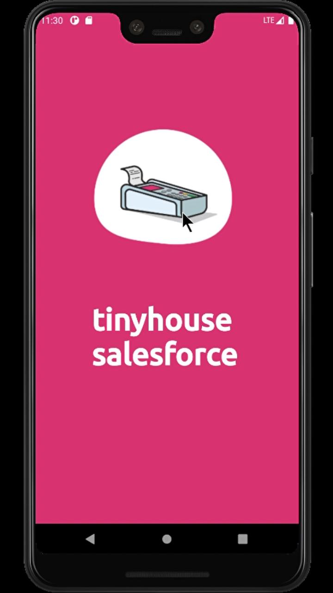

# tinyhouse-salesforce-android

**Salesforce** is a sales terminal application that will enhance the efficiency of people handling the point of sales in a seller type organization. This app keeps a track of all the transactions that each handler has done in a day, and keeps backing up data to the tinyhouse database. 

The application will have the following features: 

:large_blue_diamond:  A login page to register the current POS handler. All the registered users can sign in to their accounts with their credentials. Once logged in, the handler visits the home page of the app where they can initiate a new transaction.
 
:large_blue_diamond:  Starting a new transaction directs to an input page where the handler can choose to either enter the products manually or to take in input through a barcode scanner continuously. If the bar code option is chosen, a camera activity appears which scans for barcodes through the device's camera. The handler has to just bring the products' barcodes in front of the camera of the device one by one to capture the items in the bill. If the camera is unable to read a barcode, then the product details can be entered manually by the handler.

:large_blue_diamond:  The total number of items selected, along with the bill amount is displayed. Once the input is complete, the handler can either choose to edit the bill or else can end the input and simply proceed further towards the payment page by clicking the finish button. The bill details and the total amount to be paid by the customer are shown on the device's screen so that the customer can make the payment accordingly. If there are any discount offers available by the seller, they can be applied to the transaction at this point by the handler upon the customer's request.

:large_blue_diamond:  Payment can be done via UPI. The customer just needs to scan the QR with any UPI app to complete the payment. The handler receives the payment and then informs the app that the transaction has been completed, after which the app asks for the customer's email or phone number to send the transaction details. If a printer is connected to the device, then the app sends a request to print the bill receipt for the customer.

:large_blue_diamond:  All the transaction details of the day are backed up to the tinyhouse database and are also displayed on the activity page of the app. This way the app maintains a record of all the transactions that each handler has done in a day.

## Screenshots

  
   
  

## Requirements
Minimum Android SDK: *Salesforce requires a minimum API level of 21* 
Compile Android SDK: *Salesforce requires you to compile against API 29 or later*

    
